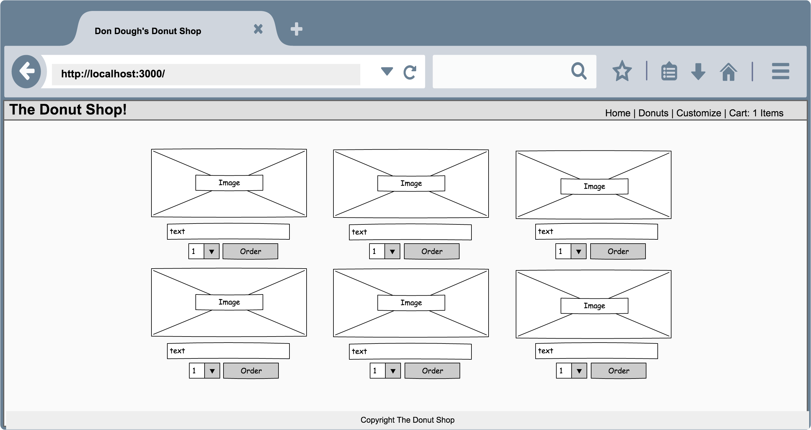
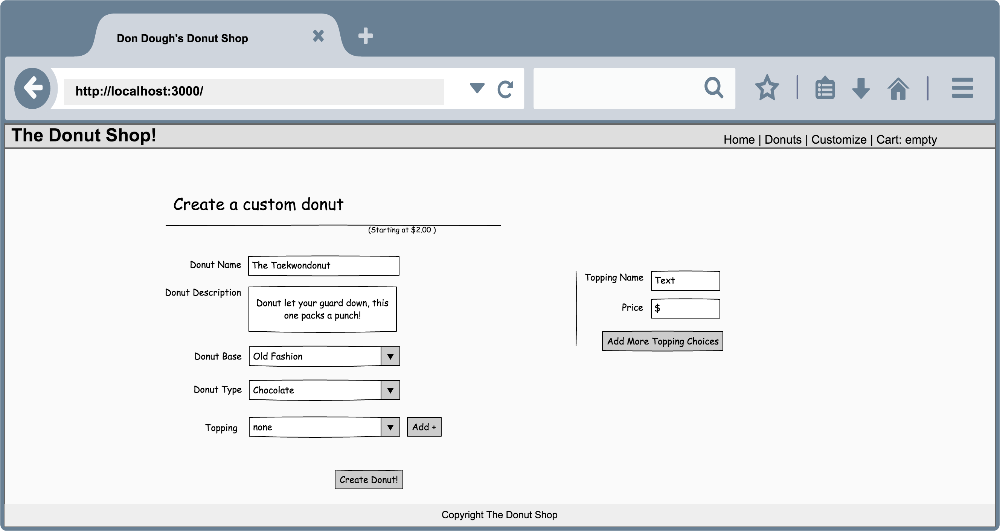
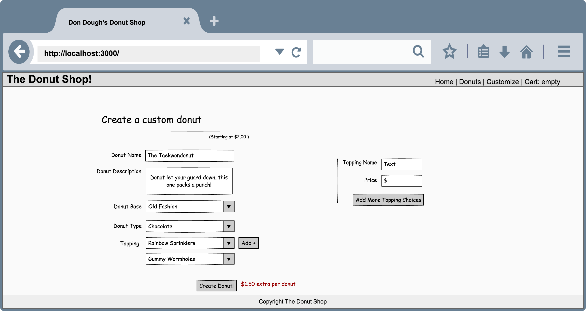
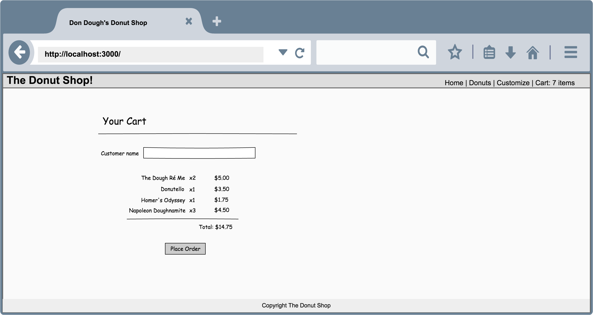
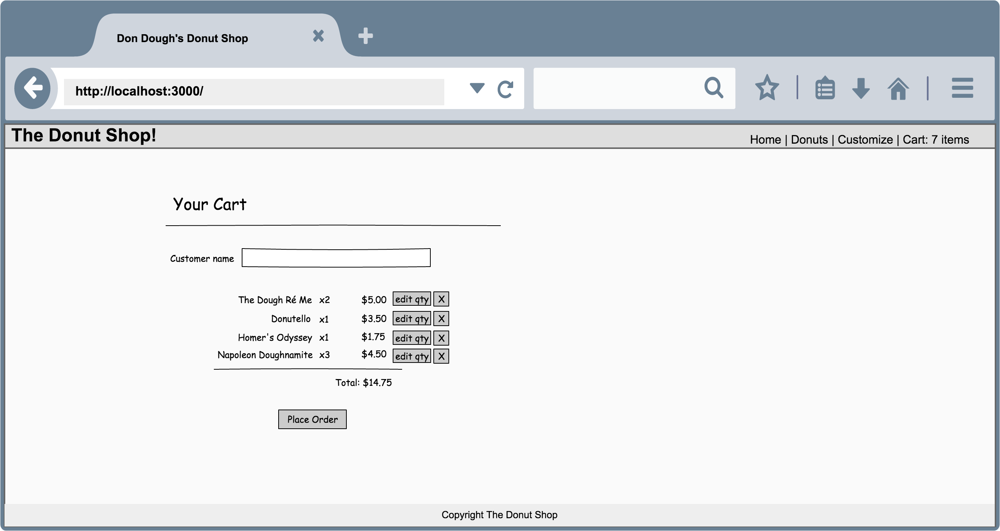

---------------------------------
---------------------------------

## User Stories
- [Home](#home)
- [All Donuts](#all-donuts)
- [Customize (New Donut)](#customize-new-donut)
- [Cart/Checking out](#cartchecking-out)

---------------------------------
---------------------------------

# Home

# All Donuts

---------------------------------

## As a user, I want to be able to see all the donuts available so that I can shop

---------------------------------

## As a user, I want to be able to add donuts to cart so that I can place a final order when I'm done shopping

Actions:

- Select a quantity from the drop down menu
- Click order

Acceptance Criteria:

- The menu shows the correct item quantity in the cart.
- It will include the specific donut and quantity when I visit the cart.

---------------------------------
# Customize (New Donut)

---------------------------------

## As a user, I want to be able to create custom donuts so that others can order my creations

Actions:

- Complete custom donut form:
  - Fill out donut name input field (required)
  - Fill out donut description textbox (required)
  - Select donut base from drop down menu (required)
  - Select donut type from drop down menu (required)
  - Select donut topping from drop down menu
- Click 'Create Donut!'

Acceptance Criteria:

- Shows additional cost for topping
- Redirects to Donuts page which displays newly created donut

---------------------------------

## As a user, I want to be able to add additional toppings to my custom donut, so that I can make awesome donuts (yay!)

Actions:

- Click on the 'add +' button

Acceptance Criteria:

- An additional dropdown list for toppings should appear
- Shows total additional cost for all toppings

---------------------------------

## As a user, I want to be able to add custom toppings, so that I can have more options in the topping drop down list

Actions:

- Complete the new topping form:
  - Fill out topping name input field (required)
  - Fill out price input field, formatted as currency (required)
- Click 'Add More Topping Choices'  

Acceptance Criteria:

- New topping added message is displayed
- Toppings dropdown lists now include the new topping

---------------------------------

# Cart/Checking out

## As a user, I want to be able to place an order so that I can finally get some yummy donuts

Actions:

- Fill out customer name input field
- Click 'Place Order'

Acceptance Criteria:

- Redirects to order confirmation

Cart

Order Confirmation

---------------------------------

## As a user, I want to be able to change my order so that I can change my mind

Actions:

- Editing quantity:
  - Click 'edit qty' 
  - Quantity is able to be updated
  - Click button to save / confirm new quantity
- Removing Item in Cart:
  - Click 'X' for certain item

Acceptance Criteria:

- New quantity/item list is saved even after I visit other pages.

---------------------------------